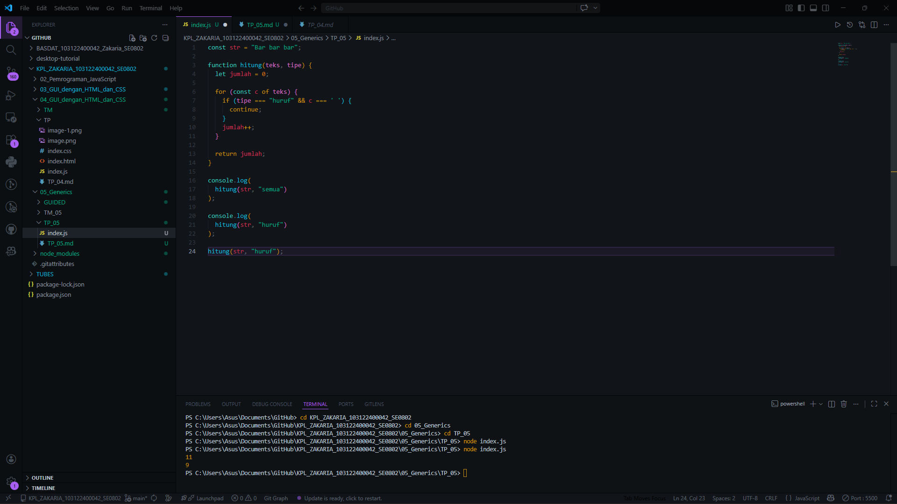

# Tugas Pendahuluan 05: Pemrograman JavaScript

## Soal

Bagaimana caramu hanya dengan satu fungsi generik bisa mengurus keduanya?

## Kode sumber

Tersedia di index.js

## Output

## Deskripsi Program

Generics ada pada bahasa pemrogramman yang memiliki tipe statis (static typing), yang artinya tipe data diikit pada variabelnya, bukan pada nilainya.