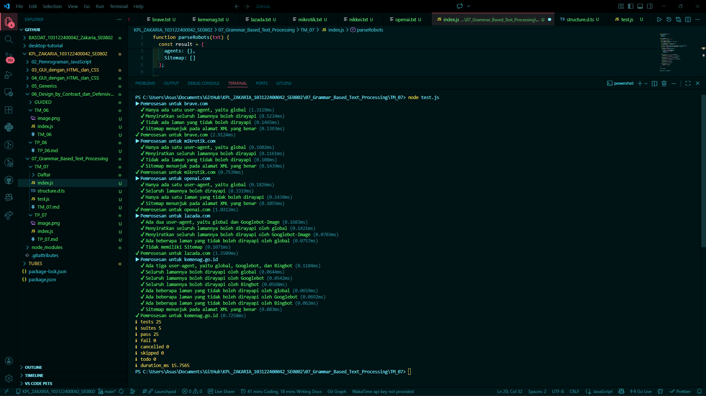

# Tugas Mandiri 07: Pemrograman JavaScript

## Soal

Tugas pada kesempatan kali ini adalah membuat fungsi yang menguraikan isi robots.txt menjadi POJO (plain old JavaScript object). Empat properti yang perlu diuraikan dijabarkan di bawah berikut.

1. User-agent adalah nama robot perayapnya
2. Allow adalah daftar halaman-halaman yang boleh dirayap
3. Disallow adalah daftar halaman-halaman yang tidak boleh dirayap
4. Sitemap adalah sebuah pranala yang menunjuk pada "denah" situs web (biasanya berformat XML)

## Kode sumber

Tersedia di index.js

## Output

## Deskripsi Program

Penguraian (parsing) adalah proses mengubah teks menjadi struktur data berformat tertentu. Kegiatan penguraian seringkali identik dengan perpecahan atau pemisahan rangkaian teks dan membuat representasi yang menunjukkan hubungan atau arti dari pecahan-pecahan yang dilakukan.