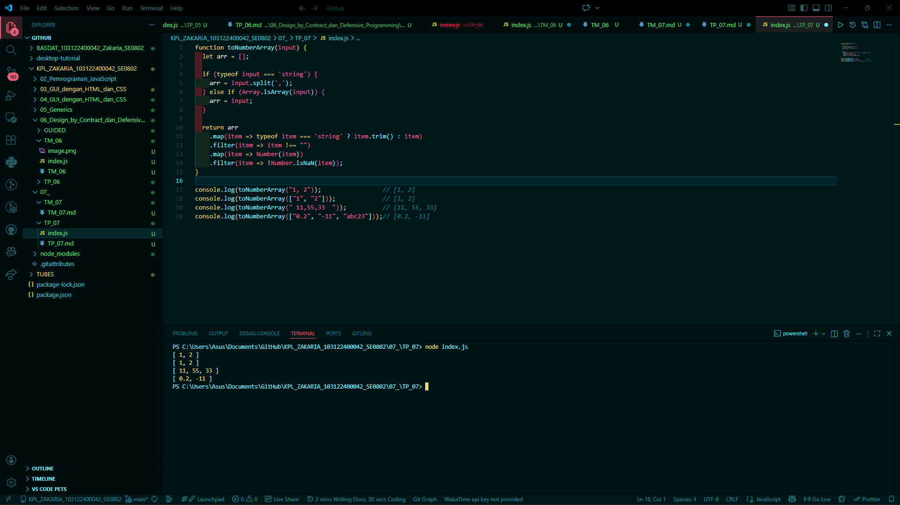

# Tugas Mandiri 07: Pemrograman JavaScript

## Soal

Buatlah fungsi yang mengubah deretan angka bertipe string menjadi larik angka.

## Kode sumber

Tersedia di index.js

## Output

## Deskripsi Program

Penguraian (parsing) adalah proses mengubah teks menjadi struktur data berformat tertentu. Kegiatan penguraian seringkali identik dengan perpecahan atau pemisahan rangkaian teks dan membuat representasi yang menunjukkan hubungan atau arti dari pecahan-pecahan yang dilakukan.