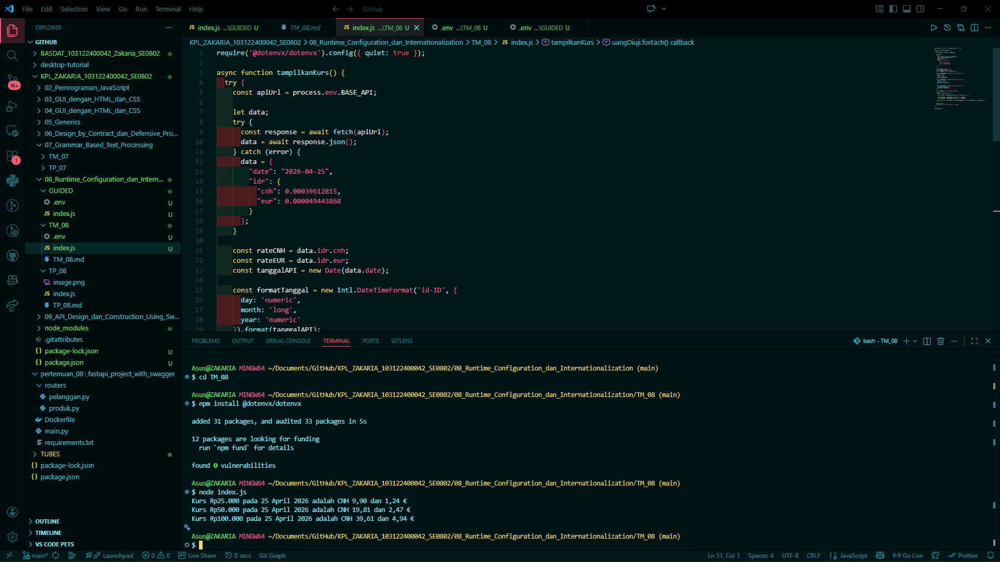

# Tugas Mandiri 08: Pemrograman JavaScript

## Soal

Pada tugas ini kamu akan membuat program yang menampilkan kurs rupiah (IDR) terhadap renminbi luar Tiongkok (CNH) dan euro (EUR). Gunakan link API ini untuk mengambil data.

## Kode sumber

Tersedia di index.js

## Output

## Deskripsi Program

Runtime configuration adalah pengaturan-pengaturan yang kita buat di luar aplikasi untuk menentukan bagaimana aplikasi berinteraksi dengan lingkungannya (runtime). Tujuannya adalah agar lingkungannya tahu apa keperluan khusus aplikasi itu.