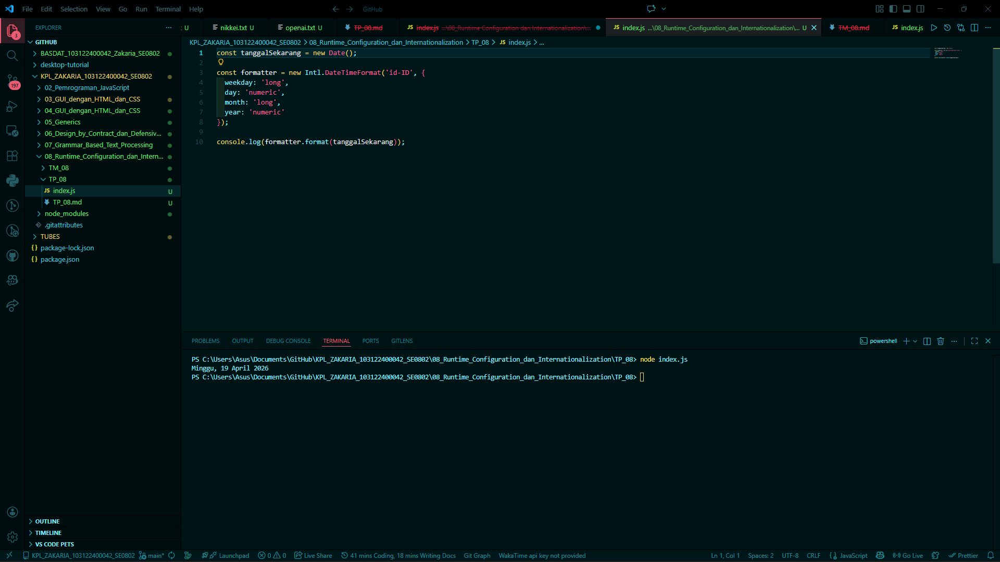

# Tugas Mandiri 08: Pemrograman JavaScript

## Soal

Tampilkan tanggal sekarang dengan format seperti ini:

Sabtu, 18 April 2026

Nilai waktu tidak harus sama, asalkan formatnya benar dan bisa tampil di komputer terpisah pada waktu tertentu. Gunakan Intl.DateTimeFormat (bukan string manual).

## Kode sumber

Tersedia di index.js

## Output

## Deskripsi Program

Runtime configuration adalah pengaturan-pengaturan yang kita buat di luar aplikasi untuk menentukan bagaimana aplikasi berinteraksi dengan lingkungannya (runtime). Tujuannya adalah agar lingkungannya tahu apa keperluan khusus aplikasi itu.