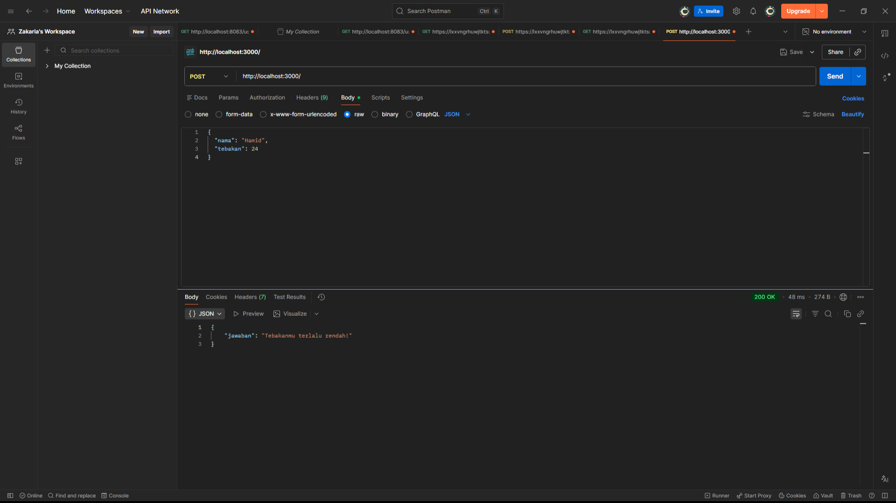

# Tugas Mandiri 09: Pemrograman JavaScript

## Soal

<details open=""><slot id="details-content" pseudo="details-content"><p>Tugasmu adalah membuat API yang terdiri dari satu endpoint saja, yaitu<span> </span><code>POST /</code>. Ketika kita melakkukan<span> </span><code>POST</code>, formatnya adalah seperti di bawah ini.</p><div class="highlight highlight-source-json notranslate position-relative overflow-auto"><pre>{
  <span class="pl-ent">"nama"</span>: <span class="pl-s"><span class="pl-pds">"</span>Hamid<span class="pl-pds">"</span></span>,
  <span class="pl-ent">"tebakan"</span>: <span class="pl-c1">24</span>
}</pre><div class="zeroclipboard-container position-absolute right-0 top-0"><clipboard-copy aria-label="Copied!" class="ClipboardButton btn js-clipboard-copy m-2 p-0" data-copy-feedback="Copied!" data-tooltip-direction="w" value="{
  "nama": "Hamid",
  "tebakan": 24
}" tabindex="0" role="button"><svg aria-hidden="true" data-component="Octicon" height="16" viewBox="0 0 16 16" version="1.1" width="16" data-view-component="true" class="octicon octicon-copy js-clipboard-copy-icon m-2 tmp-m-2"></svg></clipboard-copy></div></div><p>Jika tebakan benar.</p><div class="highlight highlight-source-json notranslate position-relative overflow-auto"><pre>{
    <span class="pl-ent">"jawaban"</span>: <span class="pl-s"><span class="pl-pds">"</span>Benar sekali! Tebakannya adalah 24.<span class="pl-pds">"</span></span>
}</pre><div class="zeroclipboard-container position-absolute right-0 top-0"><clipboard-copy aria-label="Copy code to clipboard" class="ClipboardButton btn js-clipboard-copy m-2 p-0" data-copy-feedback="Copied!" data-tooltip-direction="w" value="{
    "jawaban": "Benar sekali! Tebakannya adalah 24."
}" tabindex="0" role="button"><svg aria-hidden="true" data-component="Octicon" height="16" viewBox="0 0 16 16" version="1.1" width="16" data-view-component="true" class="octicon octicon-copy js-clipboard-copy-icon m-2 tmp-m-2"></svg></clipboard-copy></div></div><p>Jika tebakan terlalu tinggi.</p><div class="highlight highlight-source-json notranslate position-relative overflow-auto"><pre>{
    <span class="pl-ent">"jawaban"</span>: <span class="pl-s"><span class="pl-pds">"</span>Tebakanmu terlalu tinggi!<span class="pl-pds">"</span></span>
}</pre><div class="zeroclipboard-container position-absolute right-0 top-0"><clipboard-copy aria-label="Copy code to clipboard" class="ClipboardButton btn js-clipboard-copy m-2 p-0" data-copy-feedback="Copied!" data-tooltip-direction="w" value="{
    "jawaban": "Tebakanmu terlalu tinggi!"
}" tabindex="0" role="button"><svg aria-hidden="true" data-component="Octicon" height="16" viewBox="0 0 16 16" version="1.1" width="16" data-view-component="true" class="octicon octicon-copy js-clipboard-copy-icon m-2 tmp-m-2"></svg></clipboard-copy></div></div><p>Jika tebakan terlalu rendah.</p><div class="highlight highlight-source-json notranslate position-relative overflow-auto"><pre>{
    <span class="pl-ent">"jawaban"</span>: <span class="pl-s"><span class="pl-pds">"</span>Tebakanmu terlalu rendah!<span class="pl-pds">"</span></span>
}</pre><div class="zeroclipboard-container position-absolute right-0 top-0"><clipboard-copy aria-label="Copy code to clipboard" class="ClipboardButton btn js-clipboard-copy m-2 p-0" data-copy-feedback="Copied!" data-tooltip-direction="w" value="{
    "jawaban": "Tebakanmu terlalu rendah!"
}" tabindex="0" role="button"><svg aria-hidden="true" data-component="Octicon" height="16" viewBox="0 0 16 16" version="1.1" width="16" data-view-component="true" class="octicon octicon-copy js-clipboard-copy-icon m-2 tmp-m-2"></svg></clipboard-copy></div></div><p>Beberapa aturan:</p><ol data-tight="true"><li><p>Angka acak yang dihasilkan harus tetap dan tidak boleh berubah setiap kali permintaan API dilakukan, tetapi boleh berubah setiap harinya atau dibuat tetap selamanya</p></li><li data-node-id="20260516034648-d5ok5m2"><p>Rentang harus di antara 1-100</p></li><li><p>Nama harus sensitif terhadap besar kecil huruf (mis.<span> </span><code>hamid</code><span> </span>dan<span> </span><code>Hamid</code><span> </span>akan menghasilkan angka acak yang berbeda)</p></li><li data-node-id="20260516034648-jnfo68c"><p>Tidak menggunakan pustaka apapun, murni mengandalkan nama dan tebakan</p></li></ol><p>Penjelasan untuk nomor 1: Jika namanya<span> </span><code>Hamid</code>, ia akan diharapkan tetap pada nilai tebakan<span> </span><code>24</code><span> </span>mau kamu melakukan 100 kali permintaan. Tidak ada jawaban benar di sini (<code>Hamid</code><span> </span>tidak harus<span> </span><code>24</code>, bebas mau dibuat acak seperti apa yang penting harus tetap).</p></slot></details>

Tugasmu adalah membuat API yang terdiri dari satu endpoint saja, yaitu `POST /`. Ketika kita melakkukan `POST`, formatnya adalah seperti di bawah ini.

```json
{
  "nama": "Hamid",
  "tebakan": 24
}
```

Jika tebakan benar.

```json
{
    "jawaban": "Benar sekali! Tebakannya adalah 24."
}
```

Jika tebakan terlalu tinggi.

```json
{
    "jawaban": "Tebakanmu terlalu tinggi!"
}
```

Jika tebakan terlalu rendah.

```json
{
    "jawaban": "Tebakanmu terlalu rendah!"
}
```

Beberapa aturan:

1. Angka acak yang dihasilkan harus tetap dan tidak boleh berubah setiap kali permintaan API dilakukan, tetapi boleh berubah setiap harinya atau dibuat tetap selamanya
2. Rentang harus di antara 1-100
3. Nama harus sensitif terhadap besar kecil huruf (mis. `hamid` dan `Hamid` akan menghasilkan angka acak yang berbeda)
4. Tidak menggunakan pustaka apapun, murni mengandalkan nama dan tebakan

Penjelasan untuk nomor 1: Jika namanya `Hamid`, ia akan diharapkan tetap pada nilai tebakan `24` mau kamu melakukan 100 kali permintaan. Tidak ada jawaban benar di sini (`Hamid` tidak harus `24`, bebas mau dibuat acak seperti apa yang penting harus tetap).

## Kode sumber

Tersedia di index.js

## OUTPUT



## Deskripsi Program

API ini menyediakan satu endpoint utama (`POST /`) yang memungkinkan pengguna mengirimkan nama dan angka tebakan. Program kemudian membandingkan tebakan tersebut dengan "angka rahasia" yang dihasilkan secara unik untuk setiap nama.
