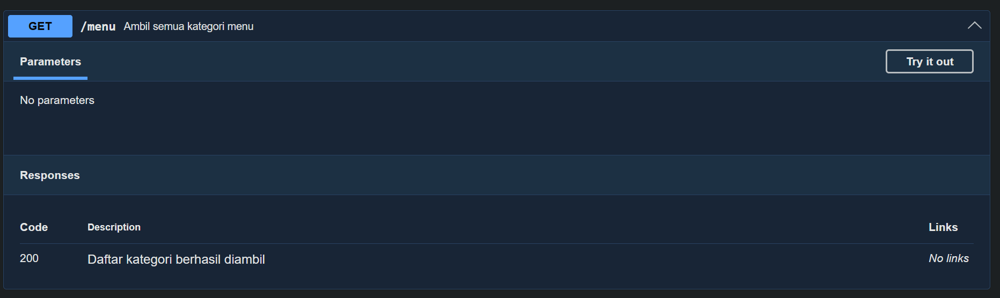
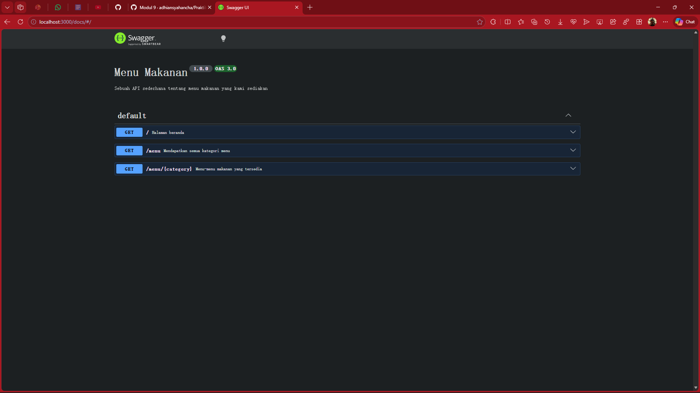

# Tugas Pendahuluan 08: Pemrograman JavaScript

## Soal

Buatlah satu endpoint lagi beserta dokumentasi OpenAPI-nya, yaitu GET /menu yang menampilkan daftar semua nama kategori menu yang ada.

## Kode sumber

Tersedia di index.js dan swagger.js

## Output

## Deskripsi Program

Endpoint GET /menu digunakan untuk mengambil daftar seluruh kategori menu yang tersedia dalam sistem, seperti bakmi dan rames, dengan cara membaca kunci (key) dari data menu yang ada, lalu mengembalikannya dalam bentuk array JSON sehingga client dapat mengetahui kategori apa saja yang bisa diakses tanpa perlu memasukkan parameter tambahan.
