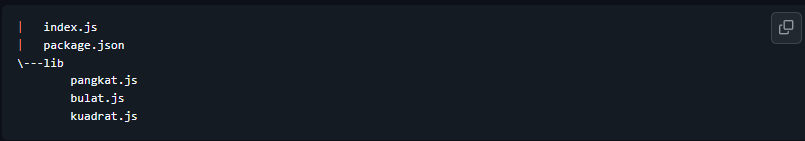
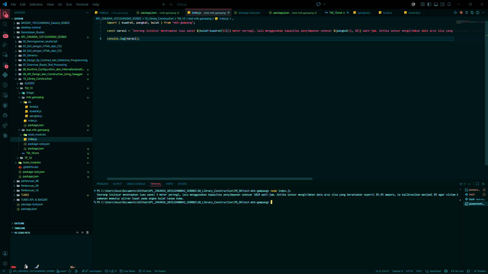

# Tugas Pendahuluan 10: Pemrograman JavaScript

## Soal

Buatkan pustaka yang rapi!

Pada tugas ini buatlah sebuah proyek baru bernama `mtk-gampang`. Struktur proyeknya wajib diatur seperti di bawah ini.

Setiap berkas `lib` hanya memiliki satu fungsi saja.

1. `pangkat.js` berisi fungsi `pangkat(x, y)` yang mengembalikan nilai akhir dari x pangkat y.
2. `bulat.js` berisi fungsi `bulat(x)` yang mengubah bentuk bilangan non-bulat menjadi bulat (mis. `-4.25` menjadi `-4`) .
3. `kuadrat.js` berisi fungsi `kuadrat(x)` yang mengembalikan nilai akar kuadrat 2 dari `x`.

Satu batasannya adalah fungsi-fungsi ini harus diakses dari `index.js` (sebagai nilai dari properti `main`), bukan dari `lib` masing-masing.

Jika sudah selesai, buatlah proyek baru lagi dan instal pustaka yang kamu buat secara lokal. Pada `index.js`-nya, gunakan kode ini untuk memastikan bahwa kamu berhasil melakukannya.

import { kuadrat, pangkat, bulat } from "libr";

const narasi = `Seorang insinyur menetapkan luas panel ${bulat(kuadrat(12))} meter persegi, lalu menggunakan kapasitas penyimpanan sebesar ${pangkat(2, 10)} watt-jam. Ketika sensor mengirimkan data arus sisa yang berantakan seperti 85.95 ampere, ia kalibrasikan menjadi ${bulat(85.95)} agar sistem keamanan memutus aliran tepat pada angka bulat tanpa koma.`;

/**

* Seorang insinyur menetapkan luas panel 3 meter persegi, lalu menggunakan kapasitas penyimpanan sebesar 1024 watt-jam. Ketika sensor mengirimkan data arus sisa yang berantakan seperti 85.95 ampere, ia kalibrasikan menjadi 85 agar sistem keamanan memutus aliran tepat pada angka bulat tanpa koma.
* /

console.log(narasi);

## Kode sumber

Tersedia di index.js

## Output

## Deskripsi Program

**mtk-gampang** adalah sebuah pustaka ( *library* ) JavaScript modular yang dirancang untuk menyediakan fungsi-fungsi perhitungan matematika dasar secara efisien. Pustaka ini menonjolkan struktur direktori yang rapi ( *clean structure* ) dengan memisahkan setiap logika fungsi ke dalam berkas tersendiri untuk memudahkan pemeliharaan kode.

### Struktur Proyek dan Modularitas

Pustaka ini diatur dengan hierarki yang ketat untuk memastikan skalabilitas:

* **Direktori `lib/`** : Berisi berkas inti di mana setiap berkas hanya mengelola satu fungsi spesifik.
* **Berkas `index.js`** : Berfungsi sebagai pintu gerbang utama ( *main entry point* ). Pengguna tidak mengakses folder `lib` secara langsung, melainkan melalui ekspor terpusat di berkas ini.
* **ES Modules (ESM)** : Menggunakan sistem modul modern (`import/export`) dengan konfigurasi `"type": "module"` pada berkas `package.json`.

### Fitur Utama (Fungsi Utilitas)

Pustaka ini menyediakan tiga fungsi utama yang mendukung perhitungan teknis:

1. **`pangkat(x, y)`** : Menghitung dan mengembalikan nilai dari variabel **$x$** yang dipangkatkan dengan **$y$**.
2. **`bulat(x)`** : Berfungsi untuk menyederhanakan angka desimal menjadi angka bulat dengan cara membuang bagian komanya (misalnya, angka -4.25 akan diproses menjadi -4).
3. **`kuadrat(x)`** : Menghitung dan mengembalikan nilai akar kuadrat dari bilangan **$x$**.

### Mekanisme Penggunaan

Pustaka ini dirancang untuk diinstal secara lokal pada proyek lain menggunakan perintah `npm install` dengan referensi alamat *folder* fisik. Setelah terinstal, pengembang dapat mengimpor fungsi-fungsi tersebut untuk kebutuhan pengolahan data sensor atau kalkulasi teknis lainnya, seperti pada simulasi narasi kalibrasi arus listrik dan luas panel.
