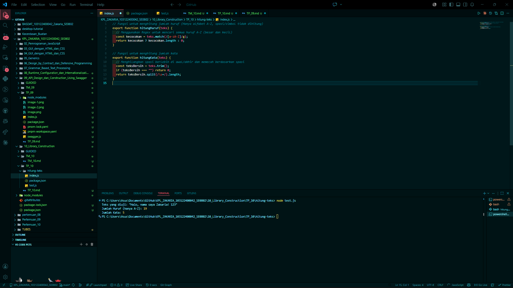

# Tugas Pendahuluan 10: Pemrograman JavaScript

## Soal

Buatlah pustaka JavaScript yang menyediakan utilitas berupa dua fungsi yang menghitung jumlah huruf dan jumlah kata.

Kriteria:

1. Hanya alfabet A hingga Z yang dihitung (besar dan kecil)
2. Spasi tidak dihitung
3. Pustaka bisa diimpor

## Kode sumber

Tersedia di index.js dan test.js

## Output

## Deskripsi Program

Program ini adalah sebuah pustaka ( *library* ) utilitas teks berbasis JavaScript yang dirancang menggunakan arsitektur  **ES Modules (ESM)** . Pustaka ini menyediakan dua fungsi utama untuk menganalisis string masukan, yaitu menghitung jumlah huruf alfabet spesifik dan menghitung total kata. Karena bersifat modular, fungsi-fungsi di dalam program ini tidak berjalan sendiri, melainkan diekspor agar dapat diimpor dan digunakan oleh berkas JavaScript lainnya.

**Fitur dan Fungsi Utama:**

* **Fungsi `hitungHuruf(teks)`:**
  Fungsi ini bertugas untuk menghitung total huruf yang ada di dalam sebuah teks. Sesuai kriteria, fungsi ini secara ketat  **hanya menghitung karakter alfabet (A-Z dan a-z)** .
  * **Cara kerja:** Program memanfaatkan *Regular Expression* (Regex) `/[a-zA-Z]/g` melalui metode `match()`. Dengan pola ini, karakter lain seperti angka, tanda baca, simbol, dan **spasi** akan diabaikan secara otomatis. Jika ditemukan kecocokan, program akan mengembalikan panjang *array* dari huruf-huruf tersebut.
* **Fungsi `hitungKata(teks)`:**
  Fungsi ini bertugas untuk menghitung jumlah kata di dalam teks.
  * **Cara kerja:** Pertama, program membersihkan spasi berlebih di awal dan akhir teks menggunakan metode `trim()`. Jika teks kosong, program langsung mengembalikan nilai 0. Jika tidak, program menggunakan metode `split(/\s+/)` untuk memecah kalimat menjadi kumpulan kata yang dipisahkan oleh satu atau beberapa spasi, lalu mengembalikan jumlah kata tersebut.

**Konfigurasi Sistem:**
Agar sistem ekspor-impor (ESM) dapat berjalan di lingkungan Node.js, program ini dikonfigurasi dengan menambahkan properti `"type": "module"` di dalam berkas `package.json`. Hal ini memungkinkan penggunaan sintaks `export` pada fungsi-fungsi utilitas tersebut.
