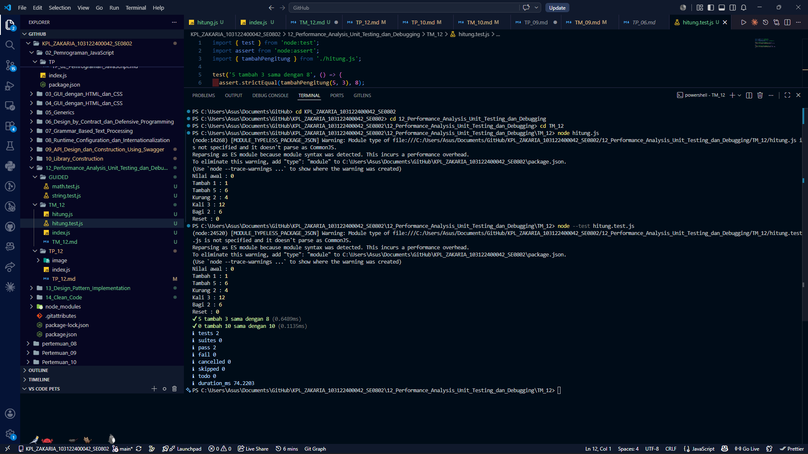

# Tugas Mandiri 12: Pemrograman JavaScript

## Soal

Tambah dan tambah!

Fungsi di bawah ini melakukan penjumlaha pada penghitung ( *counter* ), yang sesederhana menambahk jumlah jika kamu menekan tombol.

`hitung.js`

function tambahPengitung(terkini, jumlah) {
  terkini = terkini + jumlah;
  return terkini;
}

hitung.test.js

import { test } from 'node:test';
import assert from 'node:assert';
import { tambahPengitung } from './hitung.js';

test('5 tambah 3 sama dengan 8', () => {
  assert.strictEqual(tambahPengitung(5, 3), 8);
});

test('0 tambah 10 sama dengan 10', () => {
  assert.strictEqual(tambahPengitung(0, 10), 10);
});

Bisakah kamu tunjukkan apakah kode sudah benar atau bagian mana yang perlu diperbaiki beserta alasannya?

## Kode sumber

Tersedia di index.js, hitung.js,dan hitung.test.js

## Output

## Deskripsi Program

Program ini adalah sebuah modul perangkat lunak berbasis JavaScript yang dirancang untuk melakukan operasi aritmatika dasar guna mengelola nilai penghitung ( *counter* ). Program ini bertujuan untuk memberikan fungsi utilitas yang dapat digunakan dalam aplikasi yang membutuhkan manipulasi angka secara terstruktur.
