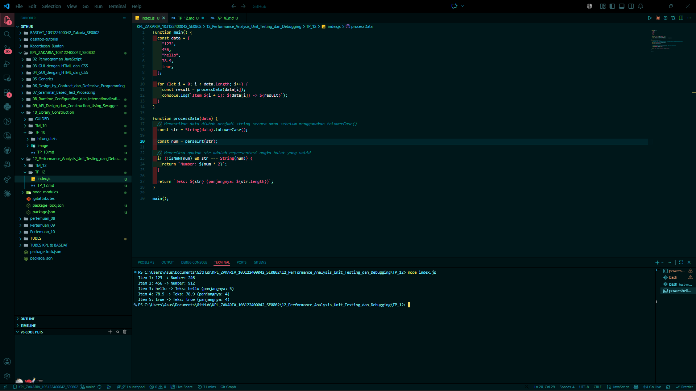

# Tugas Pendahuluan 12: Pemrograman JavaScript

## Soal

Cobalah untuk menangkap kecacatan dalam kode ini

function main() {
  const data = [
    "123",
    456,
    "hello",
    78.9,
    true,
  ];

  for (let i = 0; i < data.length; i++) {
    const result = processData(data[i]);
    console.log(`Item ${i + 1}: ${data[i]} -> ${result}`);
  }
}

function processData(data) {
  const str = data.toLowerCase();
  const num = parseInt(str);
  if (!isNaN(num) && str === String(num)) {
    return `Number: ${num * 2}`;
  }
  return `Teks: ${str} (panjangnya: ${str.length})`;
}

main();

## Kode sumber

Tersedia di index.js dan test.js

## Output

## Deskripsi Program

Program ini adalah sebuah skrip JavaScript sederhana yang dirancang untuk mendemonstrasikan cara memproses berbagai tipe data di dalam satu larik ( *array* ) dan mengonversinya menjadi informasi yang lebih spesifik (Angka atau Teks).

### Alur Logika Program

1. **Inisialisasi Data** : Program memiliki fungsi `main()` yang menampung sebuah *array* bernama `data`. *Array* ini berisi campuran tipe data: String (`"123"`, `"hello"`), Number (`456`, `78.9`), dan Boolean (`true`).
2. **Iterasi** : Menggunakan perulangan `for`, program mengambil setiap elemen dari *array* satu per satu untuk diproses oleh fungsi utilitas.
3. **Pemrosesan (`processData`)** :

* Setiap data masuk ke tahap pemeriksaan tipe data.
* Program mencoba membedakan apakah input tersebut adalah representasi angka bulat yang valid atau sekadar teks biasa.
* Jika data dianggap angka, program akan mengembalikan nilai angka tersebut dikalikan dua.
* Jika data dianggap teks, program akan mengembalikan teks tersebut beserta informasi panjang karakternya.

### Analisis Kecacatan ( *Defect* )

Program asli memiliki kecacatan kritis pada baris `data.toLowerCase()`:

* **Masalah** : Metode `.toLowerCase()` hanya bisa digunakan pada tipe data  **String** .
* **Dampak** : Saat program bertemu dengan data `456` atau `true`, sistem akan mengalami *crash* atau terhenti karena angka dan boolean tidak memiliki metode tersebut.

### Solusi dan Perbaikan

Deskripsi program ini mencakup perbaikan yang dilakukan dengan cara membungkus input ke dalam fungsi `String(data)` sebelum dimanipulasi. Hal ini memastikan bahwa apa pun tipe data awalnya, program akan memperlakukannya sebagai teks terlebih dahulu agar metode manipulasi string dapat berjalan aman tanpa merusak alur eksekusi program.
